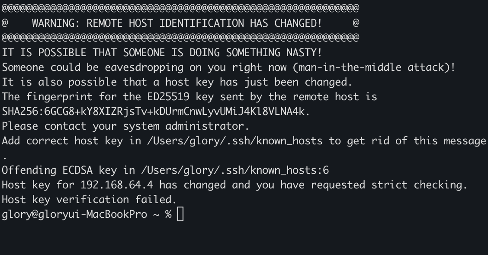

# 🚨 SSH 접속  시 Connection 문제
## 📌 문제 요약
운영 서버에서 SSH 접속을 시도할 때 아래 오류가 발생
```bash
ssh: connect to host xxx.xxx.xxx.xxx port 22: Connection reset by peer
```
```bash
ssh: connect to host xxx.xxx.xxx.xxx port 22: Connection refused
```

즉, <b>서버에 접속은 되었지만 세션이 서버에 의해 강제로 끊긴 상태</b>를 의미한다.
방화벽 차단, sshd 설정 오류, 네트워크 이슈 등 실무에서 자주 발생하는 문제.

## 🧩 문제가 발생하는 대표 원인
### 1) 서버 방화벽이 포트 22 를 차단
- iptables, firewalld, Cloud Firewall 등이 패킷을 DROP 또는 REJECT
- AWS 보안그룹 / GCP Firewall / NCP ACL 에서도 자주 발생
- 증상 : ping 은 되는데 SSH만 reset or refuse
### 2) fail2ban, sshguard 등에 의해 IP 차단
- 로그인 실패가 누적되면 자동으로 IP가 ban 됨
- 실무에서 brute force 공격 후. 정상 접속까지 막히는 경우 매우 많음
- 로그 확인
  ```bash
    /var/log/fail2ban.log
  ```
### 3) sshd_config 설정 오류
- 예
```nginx
    AllowUsers user1 user2
```
여기에 없는 계정으로 접속하면 reset or refuse 발생
- 또는
```nginx
    PasswordAuthentication no
```
패스워드 접속 차단 상태에서 비밀번호로 접속 시 reset or refuse 발생
### 4) IP 변경으로 인한 SSH known_hosts 충돌
로컬 ~/.ssh/known_hosts 에 기록된 host key 와 서버의 key가 다르면 reset 발생 가능
```makefile
    WARNING: REMOTE HOST IDENTIFICATION HAS CHANGED!
```
### 5) 서버 측 리소스 부족 (특히 max start rate)
- sshd 프로세스 여유 부족
- 파일 디스크립터 한도 초과
- Too many open file 문제로 세션 초기화 전에 종료
- 로그
  ```bash
    /var/log/secure
    /var/log/auth.log
  ```
### 6) 실제 네트워크 패킷 레벨에서 reset 발생
- 중간 방화벽에서 RST 패킷 강제 전송
- VPN/프록시 환경일 경우 더 빈번
  
## 🛠️ 해결 절차
### 1) 서버 방화벽 확인
### iptables
```bash
    sudo iptables -L -n | grep 22 # 포트 필터링 확인
```
- 만약 아무것도 나오지 않는다면 <b>특별히 22번 포트 허용 룰이 없고 기본 정책 ACCEPT 상태인 것</b>
```bash
    sudo iptables -L -v -n # 기본 정책 확인
```
- Chain INPUT (policy ACCEPT ...) → 모든 패킷 허용 상태
### firewalld
```bash
    firewall-cmd --list-all | grep ssh
```
### 클라우드 방화벽 규칙 확인
- AWS: Security Group, NACL
- GCP: Firewall rule
- Ncloud: Access Control
  
### 2) fail2ban 차단 여부 확인
```bash
    fail2ban-client status sshd
    fail2ban-client status | grep Banned
```
차단 해제
```bash
    fail2ban-client set sshd unbanip <your_ip>
```
### 3) sshd_config 검사
```bash
    vi /etc/ssh/sshd_config
```
중점 확인 사항
```nginx
    Port 22
    PasswordAuthentication yes/no
    PubkeyAuthentication yes/no
    AllowUsers
    PermitRootLogin
```
설정 반영
```nginx
    systemctl restart sshd
```
### 4) 서버 자원 확인
```bash
    top
    ulimit -n
    cat /proc/sys/fs/file-max
```
파일 핸들 고갈 시 ssh 세션 생성 불가 → reset.
### 5) known_hosts 충돌 해결
```bash
    ssh-keygen -R <server-ip>
```

## 🧪 로컬 환경에서 SSH 연결 제한 테스트

### 테스트 1 - 방화벽 설정으로 SSH 연결 막기
### 1) 방화벽 DROP(또는 REJECT)
```bash
    sudo iptables -A INPUT -P tcp --dport 22 -j REJECT
```
### 2) 클라이언트에서 접속
```bash
    ssh user@server-ip
```
→ 다음 오류 발생
```bash
    Connection reset by peer
```
```bash
ssh: connect to host xxx.xxx.xxx.xxx port 22: Connection refused
```
### 3) 원상 복구
```bash
    sudo iptables -D INPUT -P tcp --dport 22 -j REJECT
```

### 테스트2 - sshd_config 설정 문제로 reset 유도
### 1) AllowUsers 제한
/etc/ssh/sshd_config 에 다음 추가
```bash
    AllowUsers non_exist_user
```
### 2) sshd 재시작
```bash
    sudo systemctl restart sshd
```
### 3) 정상 계정으로 접속 시도
```bash
    ssh realuser@server-ip
```
### 4) 복구
해당 라인 삭제 후 다시 sshd 재시작

### 테스트3 - fail2ban 으로 강제 차단
### 1) 비밀번호를 여러 번 틀려 로그인 실패
```bash
    ssh wrong@server-ip
```
10 ~ 20회 실패하면 fail2ban이 IP를 밴함.
### 2) 정상 계정으로 접속
```bash
    ssh user@server-ip
```
→ "Connection reset by peer" 혹은 "Connection refused" 발생
### 3) unban
```bash
    fail2ban-client set sshd unbanip <client-ip>
```

### 테스트4 - known_hosts 충돌로 reset 유도
### 1) 서버 SSH key 변경
서버에서 강제로 HostKey 삭제
```bash
    sudo rm /etc/ssh/ssh_host_* # 서버의 호스트 키 삭제
    sudo dpkg-reconfigure openssh-server # Ubuntu 서버에서 새 HostKey 를 생성한다.
```
### 2) 로컬에서 접속
```bash
    ssh user@server-ip
```
→ reset 또는 identification changed 에러

### 3) 해결
```bash
    # 클라이언트 터미널에서 실행
    # 클라이언트가 저장해둔 서버의 과거 ssh 지문(Hostkey)을 삭제하는 명령
    ssh-keygen -R server-ip
```
