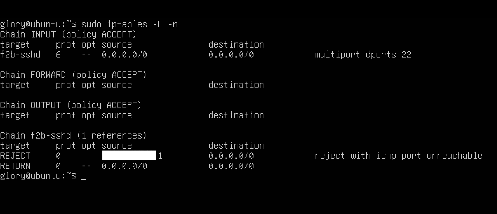

# SSH Brute Force Attack
## 1. 개요
SSH 브루트포스 공격은 봇 또는 스크립트를 사용해 SSH 계정의 비밀번호를 무작위로 계속 시도하는 공격이다.
대부분 22번 포트(또는 변경된 포트)를 대상으로 발생하며, 약한 비밀번호를 사용하는 경우 실제 계정 탈취로 이어질 수 있다.

운영 서버에서는 다음과 같은 피해로 연결될 수 있다.
- 계정 탈취 및 권한 상승
- 악성코드/랜섬웨어 설치
- 봇넷에 편입
- 내부망 확산 공격

## 2. 주요 증상
### 다음과 같은 징후가 발생한다.
- auth 로그에 Failed password 기록이 매우 빠르게 반복됨
- 동일한 IP 또는 수백 개 이상의 IP에서 반복된 로그인 시도
- CPU 사용량 소폭 상승
- 네트워크 트래픽 증가
- sshd 프로세스가 평소보다 바쁘게 동작

### 로그 예시
```bash
Failed password for root from 185.234.xxx.xxx port 53822 ssh2
Failed password for invalid user admin from 103.45.xxx.xxx port 40121 ssh2
```

일반적으로 초 단위로 수십~수백 건이 찍히는 경우가 많다.

## 3. 점검방법
### 3.1 실시간 로그 확인
Ubuntu / Debian
```bash
sudo tail -f /var/log/auth.log
```
CentOS / RHEL
```bash
sudo tail -f /var/log/secure
```
### 3.2 실패 시도 횟수 빠르게 확인
Ubuntu
```bash
sudo grep "Failed password" /var/log/auth.log | wc -l
```
공격 IP 상위 확인
```bash
sudo grep "Failed password" /var/log/auth.log | awk '{print $(NF-3)}' | sort | uniq -c | sort -nr | head
```
### 3.3 현재 접속 중인 IP 확인
```bash
who
w
ss -tunap | grep ssh
```
## 4. 원인 분석
가장 흔한 원인
- 22번 포트 그대로 사용
- 약한 비밀번호 사용
- root 직접 로그인 허용
- fail2ban 등 차단 수단 없음
- 외부에 노출된 서버

봇에 의해 무차별적으로 스캐닝된 것이 대부분이며, 특정 타겟 공격인 경우는 소수다.

## 5. 즉시 대응 방법
### 5.1 공격 IP 직접 차단
```bash
sudo iptables -A INPUT -s 185.234.xxx.xxx -j DROP
```
또는
```bash
sudo ufw deny from 185.234.xxx.xxx
```
### 5.2 SSH 기본 포트 변경
`/etc/ssh/sshd_config`
```bash
Port 2222
```
변경 후
```bash
sudo systemctl restart ssh
```

### 5.3 Root 로그인 차단
`/etc/ssh/sshd_config`
```bash
PermitRootLogin no
```
### 5.4 패스워드 로그인 비활성화 (권장)
```bash
PasswordAuthentication no
```
**이후 반드시 키 기반 접속 설정 필요.**
## 6. 근본적인 예방 방법

가장 권장되는 구성

1. SSH Key 기반 로그인
2. Fail2Ban 적용
3. 포트 변경
4. 불필요한 계정 제거

### 6.1 Fail2Ban 적용
```bash
sudo apt update
sudo apt install fail2ban -y
```
설정 파일 생성
```bash
sudo cp /etc/fail2ban/jail.conf /etc/fail2ban/jail.local
```
SSH 설정 예시
```bash
[sshd]
enabled = true
port = 2222
maxretry = 5
bantime = 3600
```
실행
```bash
sudo systemctl start fail2ban
sudo systemctl enable fail2ban
```
차단 리스트 확인
```bash
sudo fail2ban-client status sshd # ip ban list 확인
```
```bash
sudo iptables -L -n # reject 된 ip 확인
```
#### 차단된 ip 예시

**Chain f2b-sshd 하위 REJECT 부분에 공격자 ip 가 거절된 상태를 확인**
#### 차단된 ip 해제
```bash
sudo fail2ban-client set sshd unbanip 192.168.xx.xx
```
## 7. macOS UTM 환경에서 재현하는 방법
실제 공격 상황을 안전하게 가상 환경에서 재현 가능하다.
### 7.1 환경 구성
- Mac + UTM
- Ubuntu Server 또는 Desktop 설치
- 네트워크 모드: Shared Network
- SSH 활성화

Ubuntu SSH 설치
```bash
sudo apt update
sudo apt install openssh-server -y
sudo systemctl start ssh
```

IP 확인
```bash
ip a
# ex) 192.168.xx.xx
```
### 테스트용 계정 생성 (Unbuntu)
```bash
sudo adduser testuser
```
약한 비밀번호 설정 (예: 1234)
### 7.2 공격용 도구 설치
#### Ubuntu
```bash
sudo apt update
sudo apt install hydra -y
```
#### Mac
```bash
brew install hydra
```
### 7.3 브루트 포스를 유발시키는 hydra 명령어
```bash
hydra -l testuser2 -P /usr/share/wordlists/rockyou.txt ssh://192.168.xx.xx
```
이렇게 해석된다

- `-l testuser2` → 공격할 계정

- `-P` → 비밀번호 목록

- `ssh://192.168.xx.xx` → 타깃 서버

- `-s 22` → ssh 포트 (ubuntu)

명령을 실행하면 바로 다음과 같은 현상이 발생한다

Target 서버의 `/var/log/auth.log` 에 실패 기록 폭증

hydra가 자동으로 수천 개의 비밀번호 시도

비밀번호가 맞으면 성공 메시지 출력
### 7.4 Mac 과 Ubuntu 차이
#### Mac
`/usr/share/wordlists/rockyou.txt` 는 리눅스 기준이라 macOS에는 기본적으로 존재하지 않는다. 따라서 맥 환경에서는 아래와 같은 방법들을 사용하여 임의적으로 브루트포스 환경을 만든다.

Mac 환경에서 brew 명령으로 hydra 를 설치 했지만 rockyou.txt 는 자동으로 설치되지 않는다. 

하지만 rockyou.txt는 자동으로 설치되지 않는다.
따라서 직접 다운로드해서 사용하는 게 가장 정확한 방법이다.

#### 추천 방법 1
먼저 wordlist 폴더를 만든다.
```bash
mkdir ~/wordlists
```

rockyou.txt 다운로드 (Ubuntu 패키지에서 제공되는 것과 동일한 원본)
```bash
curl -o ~/wordlists/rockyou.txt https://github.com/danielmiessler/SecLists/raw/master/Passwords/Leaked-Databases/rockyou.txt
```
그 다음, hydra 실행

```bash
hydra -l testuser2 -P ~/wordlists/rockyou.txt ssh://192.168.xx.xx -s 22
```
이게 macOS 환경에서는 가장 표준적인 방식이다.
#### 추천 방법 2 - 더 안전한 실습용 미니 wordlist 사용 방법
전체 rockyou는 너무 크고 실습에는 과하다.
다음처럼 직접 파일을 만드는 방식도 있다.
```bash
echo -e "1234\n12345\npassword\ntest\ntest123\nqwer" > ~/wordlists/pass.txt
```
그리고 hydra 실행
```bash
hydra -l testuser2 -P ~/wordlists/pass.txt ssh://192.168.xx.xx
```
이 방식이 테스트에는 훨씬 빠르고 명확하다.
#### Ubuntu

#### 1) hydra 설치
```bash
sudo apt update
sudo apt install hydra -y
```
설치 확인
```bash
hydra -h
```
정상적으로 옵션이 나오면 완료
#### 2) rockyou.txt 확인
```bash
ls /usr/share/wordlists/

```
보통 있을 것
```bash
rockyou.txt.gz
```
압축일 경우
```bash
gunzip /usr/share/wordlists/rockyou.txt.gz
```
## 8. 브루트 포스 결과
Target VM에서 실행
```bash
sudo tail -f /var/log/auth.log
```
정상적으로 공격이 발생하면 이런 로그가 빠르게 찍힌다
```bash
Failed password for testuser2 from 192.168.xx.xx port 5xxxx ssh2
Failed password for testuser2 from 192.168.xx.xx port 5xxxx ssh2
Failed password for testuser2 from 192.168.xx.xx port 5xxxx ssh2
```
여기서 from 192.168.xx.xx 는 Attacker VM의 IP다.
이게 바로 브루트포스가 “유발된” 상태다.

### 성공 케이스 확인

만약 테스트 계정 비밀번호가 wordlist 안에 있다면, Attacker 쪽에서 이렇게 뜬다
```bash
[22][ssh] host: 192.168.xx.xx   login: testuser2   password: 1234
```
의미하는 것은 실제 비밀번호가 뚫렸다는 뜻이며 무에서라면 즉시 보안 사고로 간주됨